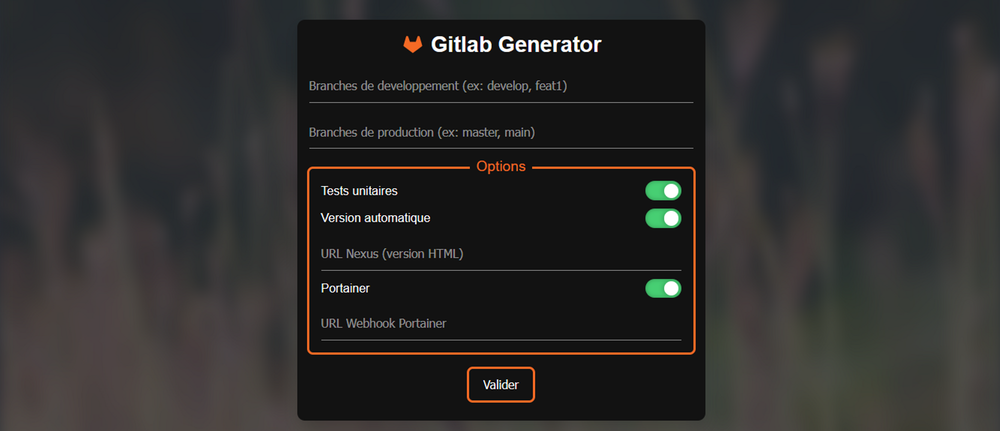

# Gitlab Generator

## Objectif

Ce projet permet de générer en quelques clics les fichiers necessaires au CI/CD des projets du Département de la Gironde.



## Contribuer au projet

### Technologies

* React
* SCSS

### Prérequis

* NodeJS

### Commandes

#### Lancer localement

```bash
npm install
npm run dev
```

#### Déployer l'application

```bash
npm run deploy
```
